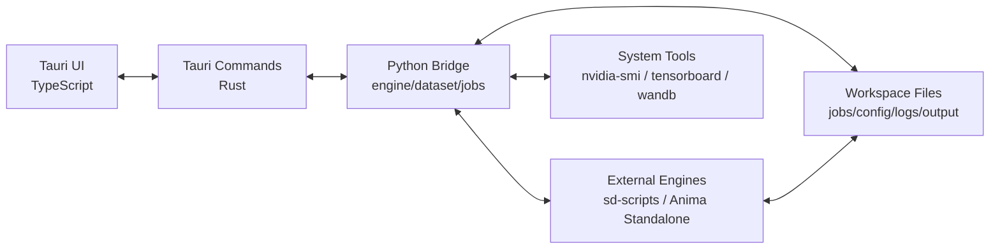

# アーキテクチャ設計

## 結論

Tauriデスクトップアプリを本体にし、学習エンジンは外部プロセスとして扱う。

Tauri/RustはOS統合、プロセス管理、ファイル選択、ログストリームを担当する。Python bridgeは学習ドメインの処理、TOML生成、dataset操作、engine adapterを担当する。TypeScript UIは状態編集と可視化に集中する。

## 全体構成



## レイヤー

### UI layer

候補:

- Tauri
- Vite
- TypeScript
- React
- ZustandまたはTanStack Query
- Zodによるフォーム入力検証

責務:

- ジョブ一覧と編集画面。
- 設定フォーム。
- ログとメトリクス表示。
- サンプル画像ブラウザ。
- ユーザー操作をTauri commandに渡す。

UIはエンジン固有のコマンド文字列を直接組み立てない。設定オブジェクトを編集し、bridgeに計画と検証を依頼する。

### Native layer

Tauri/Rustの責務:

- Python bridgeの起動。
- 長時間プロセスの開始、停止、ログ転送。
- ファイル/フォルダ選択。
- OS通知。
- 外部フォルダを開く。
- 動的ポート検出。

テンプレートのPython bridge方式を拡張し、短時間ジョブと長時間ジョブを分ける。

- request/response系: GPU検出、設定読込、preflight、TOML生成。
- managed process系: train、sample server、TensorBoard、tagger。

### Python bridge layer

責務:

- `EngineAdapter` インターフェース。
- TOML/JSONの読み書き。
- dataset scanとcaption編集。
- launch plan生成。
- preflight validation。
- ログパース。
- GPU/環境診断補助。

Python側は外部エンジンと同じPython依存を使えるため、TOML、画像処理、tagger、sd-scripts関連の処理を置きやすい。

### Engine layer

初期対応候補:

1. `AnimaStandaloneAdapter`
   - `D:\tool\lora_trainer\Anima-Standalone-Trainer` を既存rootとして登録できる。
   - `architectures.json` 的なモデル系列レジストリを利用する。
   - DDP/FSDP/FSDP2/DeepSpeed/TP-SPを扱う。

2. `SdScriptsAdapter`
   - kohya-ss sd-scripts互換。
   - Kohya GUIのパラメータ体系を段階的に移植する。
   - SD1/SDXL/Animaなどをモデル系列として分ける。

3. `FactoryImportAdapter`
   - LoRA Factoryは直接実行基盤というより、既存zipや設定を検出して移行支援する位置づけ。

## ジョブ実行モデル

ジョブは必ずディレクトリを持つ。

```text
jobs/
  my_lora/
    job.json
    config.toml
    dataset.toml
    sample_prompts.txt
    run_records/
      20260621-160000/
        merged_config.toml
        launch.ps1
        stdout.log
        stderr.log
        metrics.jsonl
    output/
    logs/
    samples/
```

`config.toml` は編集用、`merged_config.toml` は実行用。モデルパス、出力先、dataset path、resume stateなどは実行直前に確定する。

## Launch Plan

bridgeは実行前に `LaunchPlan` を返す。

- engine id
- executable
- args
- env
- cwd
- generated files
- display command
- warnings
- errors

UIはこれをプレビューし、Rustはこの構造化情報からプロセスを起動する。表示用コマンドと実行用argvを分けることで、引用符や空白を含むパスの事故を減らす。

## マルチGPU設計

GPU選択はジョブ設定として保存する。

初期モード:

- single
- ddp
- fsdp
- fsdp2
- deepspeed
- tp_sp

共通処理:

- `CUDA_VISIBLE_DEVICES` を設定。
- Windowsの複数GPUでは必要に応じて `USE_LIBUV=0`, `MASTER_ADDR=127.0.0.1`, `MASTER_PORT` を設定。
- モードごとに対応エンジンと対応スクリプトを検証。
- サンプル生成用GPUは学習用GPUと別設定にできる。

## ポート設計

GUI本体はTauri IPCを使い、固定HTTPポートを持たない。

必要時だけ動的ポートを割り当てるもの:

- TensorBoard
- persistent sample generation server
- engine固有の補助API

割り当てたポートはrun recordに保存し、終了時にプロセスを掃除する。

## WanDB設計

WanDBはGUI上で明示的に設定する。

- disabled
- online
- offline

設定項目:

- project
- entity
- run name template
- tags
- group
- notes
- resume policy

API keyは原則OS側またはWanDB loginに任せ、平文保存しない。必要な場合はTauri secure storage相当を検討する。

## 失敗時の扱い

Preflightで検出する項目:

- engine root不在。
- venv不在。
- Python実行不可。
- GPU未検出。
- CUDA/Torch不整合の疑い。
- モデルパス不在。
- dataset内の画像/caption不整合。
- multi-GPUモードとエンジンの非対応。
- sample prompt不在でsample有効。
- output名衝突。

実行中失敗:

- 終了コード、最後のログ、run recordをまとめて表示。
- よくあるエラーは後で分類テーブル化する。
- 再実行は同じrun recordを上書きせず、新しいrunを作る。
